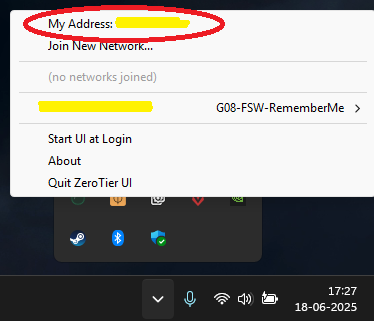

# INF360-FSW-IA

## Tutorial para Correr IA Local:

1. Descargar Ollama desde la web oficial: https://ollama.com/download

2. Desde una terminal (PowerShell o CMD si tienes Windows) correr el modelo: ollama run deepseek-r1:1.5b

## Tutorial para Hostear IA:

1. Descargar ZeroTier desde la web oficial: https://www.zerotier.com/download/

2. Decirle al Alessandro que te Integre a la Red de ZeroTier con tu direccion

3. Desde una terminal (PowerShell o CMD si tienes Windows) correr el modelo: ollama run deepseek-r1:1.5b

4. Crear una Regla en el Firewall que permita acceder al Puerto donde correra la IA (11434)

5. Desde una terminal diferente con la Ollama, ZeroTier y la IA corriendo ejecutar: 

 - PowerShell: set OLLAMA_HOST="0.0.0.0"; ollama serve